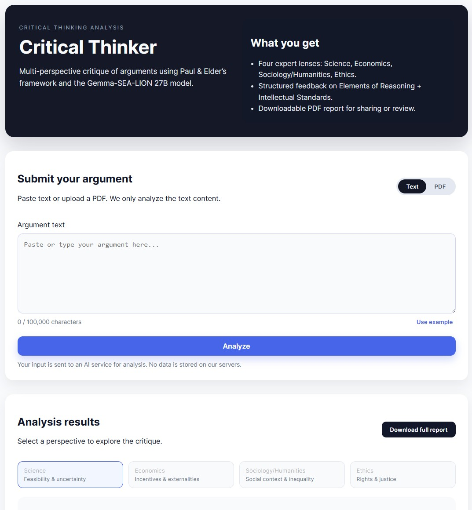
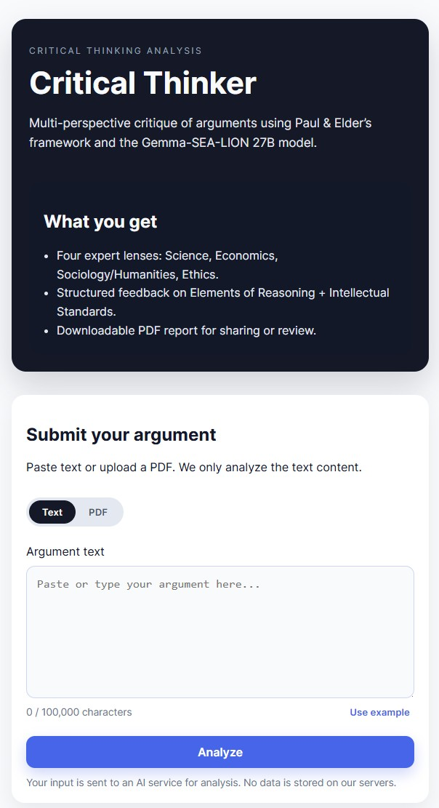
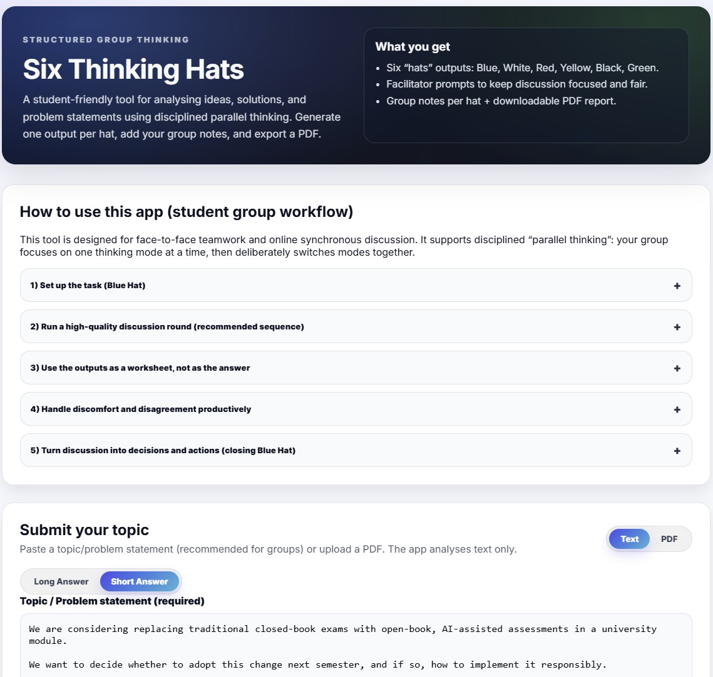
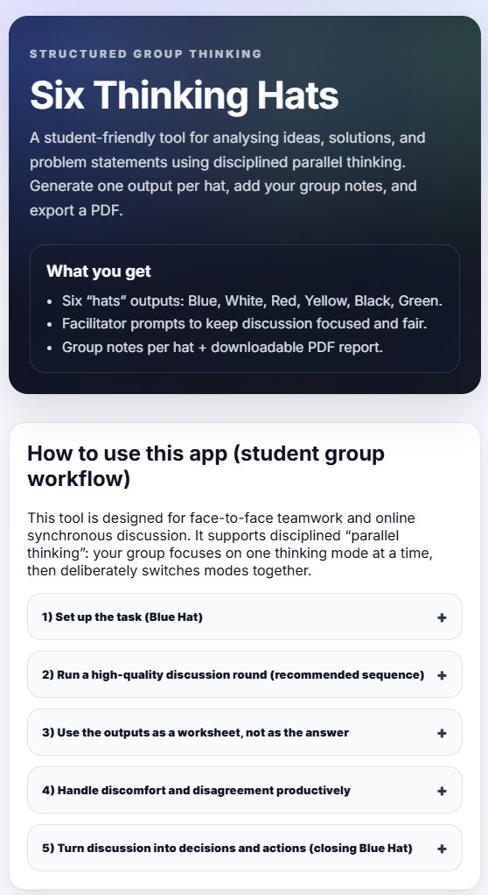
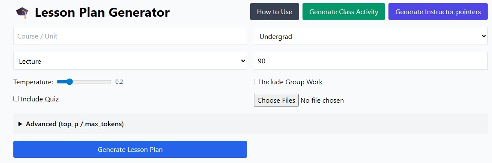

# Human-Centred AI for Learning, Work, and Decision Support

I design and prototype AI-enabled tools that augment human judgement rather than replace it.

My work sits at the intersection of higher education, organisational behaviour, learning design, assessment innovation, and applied AI systems. This GitHub profile documents practical prototypes for teaching, research, structured reasoning, retrieval-augmented generation, and human-AI interaction.

---

## Design philosophy

AI should amplify human potential, not replace it.

The tools here are built around three principles:

1. **Augmentation over automation** — AI should support judgement, reflection, and better decisions.
2. **Evidence over fluency** — answers should be grounded in curated sources where possible.
3. **Pedagogy before novelty** — educational AI tools should improve learning processes, not merely generate content.

---

## Featured projects

| Project | Purpose | Demonstrates | Links |
|---|---|---|---|
| **Ask-Julia** | Evidence-grounded voice avatar for higher education knowledge exploration | RAG, avatar UX, evidence summaries, speech interaction | [Project](https://github.com/AlvesMH/AlvesMH/blob/main/img/ask-julia.md) · [Live demo](https://ask-julia.onrender.com/) |
| **Critical Thinker** | Multi-perspective argument analysis using the Paul-Elder framework | Structured reasoning, critique scaffolding, PDF reporting | [Project](https://github.com/AlvesMH/AlvesMH/blob/main/img/pack/critical-thinker/README.md) · [Live demo](https://critical-thinker.onrender.com/) |
| **Six Thinking Hats** | Student group analysis workflow using Edward de Bono’s method | Parallel thinking, group reasoning, classroom workflow | [Project](https://github.com/AlvesMH/AlvesMH/blob/main/img/pack/six-hats/README.md) · [Live demo](https://six-thinking-hats.onrender.com/) |
| **Generative Lesson Planner** | AI-supported lesson design from instructor-provided materials | Learning design, RAG, instructor workflow support | [Repository](https://github.com/AlvesMH/Lesson-Planner-App) · [Live demo](https://lesson-planner-app.onrender.com/) |
| **RAG Avatar** | Context-aware avatar using uploaded documents | RAG, document Q&A, conversational interface | [Repository](https://github.com/AlvesMH/Ask-Mark-RAG-Powered-AVATAR-) · [Live demo](https://ask-mark.onrender.com/) |

> Live demos hosted on Render may take a short time to wake up on first use.

---

## Project snapshots

### Ask-Julia — interactive assistant avatar

Ask-Julia is a voice-enabled avatar designed to help people explore evidence-informed ideas about AI, teaching, learning, and higher education. It combines a conversational avatar, spoken answers, evidence summaries, and fuller explanations to make a curated knowledge base easier to use.

<table>
  <tr>
    <td align="center"></td>
    <td align="center"></td>
  </tr>
</table>

### Critical Thinker — structured argument analysis

Critical Thinker supports rigorous evaluation of arguments, essays, policy proposals, and academic texts. It operationalises critique through analytical perspectives that examine purpose, assumptions, evidence quality, reasoning standards, implications, and fairness.

<table>
  <tr>
    <td align="center"></td>
    <td align="center"></td>
  </tr>
</table>

### Six Thinking Hats — structured group reasoning

Six Thinking Hats helps students and teams separate facts, feelings, risks, benefits, creativity, and process control before producing a final synthesis. The aim is better reasoning quality, not faster content generation.

<table>
  <tr>
    <td align="center"></td>
    <td align="center"></td>
  </tr>
</table>

### Generative Lesson Planner — lesson design workflow

Generative Lesson Planner helps educators produce lesson plans, activity handouts, and instructor pointers from uploaded lesson materials. The tool is designed as a preparation assistant: educator judgement, contextual adaptation, and learning outcomes remain central.

---

## What these projects demonstrate

- Retrieval-augmented generation for curated educational knowledge bases
- AI-supported critical thinking and structured reasoning
- Human-centred interface design for learning tools
- Lightweight deployment of AI applications for real users
- Responsible AI as a scaffold for judgement, not a substitute for it

---

## Current focus

- Human-centred AI in higher education
- AI-supported assessment and feedback workflows
- RAG systems for research, teaching, and knowledge work
- Service work, job redesign, and AI adoption
- Tools that improve judgement, learning, and decision quality

---

## Additional experiments

Earlier prototypes and exploratory builds include article summarisation, ageing dashboards, Telegram bots, code review helpers, and lightweight RAG agents.

| Project | Focus | Links |
|---|---|---|
| Simple RAG Agent | PDF ingestion, vector search, semantic answer retrieval | [Repository](https://github.com/alvesmh/RAG_agent) · [Live demo](https://simple-rag-agent.onrender.com/) |
| Academic Article Summariser | Academic PDF summarisation and generation workflow | [Project](https://github.com/AlvesMH/AlvesMH/blob/main/img/Summarizer.md) · [Live demo](https://summarizer-generator.onrender.com) |
| Code Review Assistant | Lightweight AI-supported code review and improvement suggestions | [Repository](https://github.com/alvesmh/smart_code_enhancer) · [Live demo](https://code-enhancer.onrender.com/) |
| Ageing Dashboard | Demographic and fiscal-risk dashboard using World Bank data | [Repository](https://github.com/alvesmh/Ageing_Dashboard) · [Live demo](https://ageing-dashboard.onrender.com/) |

---

## Technical stack

---

## Questions guiding the work

- How can AI boost metacognition rather than cognitive offloading?
- How can educational AI tools make reasoning, evidence, and judgement more visible?
- What should be redesigned in work systems when AI reduces routine production costs?
- How can service organisations use AI without weakening the human qualities that make service valuable?

---

---

## GitHub activity

  

---
