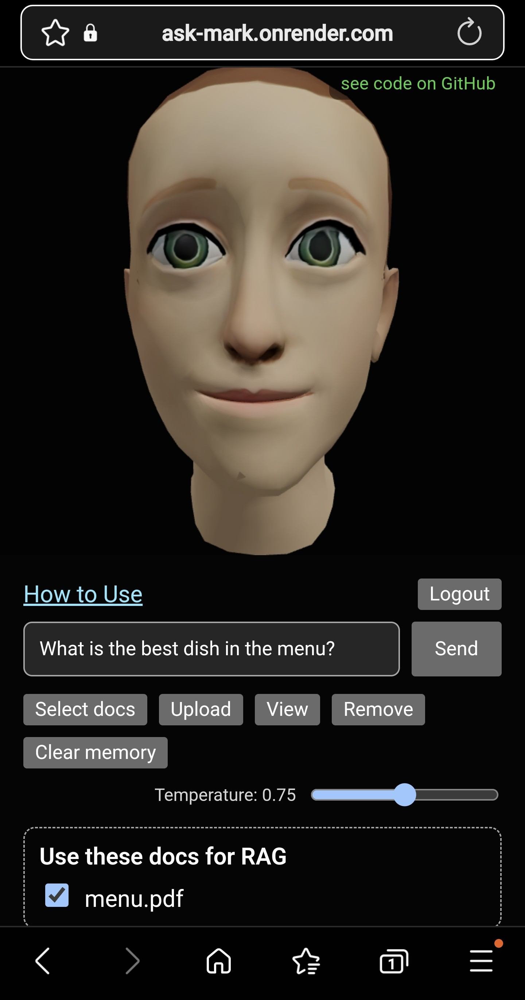

# 👋 Hi there!

Welcome to my GitHub!I use this space to prototype, document, and share **GenAI-powered tools, automation scripts, and intelligent workflows** designed to **augment human intelligence**—especially in the context of **learning, research, and strategic decision-making**.

---
## My Philosophy

I believe in **Augmented Intelligence**—AI should **amplify human potential**, not replace it. My projects often live at the intersection of **technology, ethics, and human behavior**.

---

## Featured Projects  

## 🧠 [RAG_Avatar](https://github.com/AlvesMH/Ask-Mark-RAG-Powered-AVATAR-)  |  [Live-Demo](https://ask-mark.onrender.com/)
A **Context-aware Avatar powered by Sea-Lion LLM & Pinecone**, with option of Uploading multiple Document formats for **Retrieval Augmented Generation**.

## Clean Desktop UI
<table style="border:2px solid red; border-collapse:collapse;">
  <tr>
    <td style="border:2px solid red; text-align:center; vertical-align:middle;"></td>
    <td style="border:2px solid red; text-align:center; vertical-align:middle;"></td>
  
  </tr>
</table>  

## Mobile Ready
<table style="border:2px solid red; border-collapse:collapse;">
  <tr>
    <td style="border:2px solid red; text-align:center; vertical-align:middle;"></td>
    <td style="border:2px solid red; text-align:center; vertical-align:middle;"></td>
  </tr>
</table>

### 🧠 [RAG_agent](https://github.com/alvesmh/RAG_agent)  |  [Live-Demo](https://simple-rag-agent.onrender.com/)
A **Retrieval-Augmented Generation (RAG) agent** that ingests PDF documents, converts them into embeddings in a VectorStore, and retrieves relevant answers with semantic search.  

### 🤖 [llm_bot](https://github.com/alvesmh/llm_bot)   |  [Live-Demo](https://happybotsite.onrender.com/)
**HappyBot** – A **Generative AI Telegram Companion Bot** designed to provide empathetic, context-aware interactions for lonely seniors in Singapore.  

### 🛠️ [smart_code_enhancer](https://github.com/alvesmh/smart_code_enhancer)   |  [Live-Demo](https://code-enhancer.onrender.com/)
An **AI-powered code reviewer** that detects bugs, suggests improvements, and enforces **PEP 8 compliance**—all without requiring a GPU or complex setup.  

### 📊 [Ageing_Dashboard](https://github.com/alvesmh/Ageing_Dashboard)   |  [Live-Demo](https://ageing-dashboard.onrender.com/)
An interactive **Streamlit dashboard** to visualize and forecast aging-related fiscal and demographic risks using **World Bank data** and **ARIMA models**.  

* You may need to wait a few seconds for Render to load the Live-Demos
---

## 🛠️ Tech Stack  

---

## 📈 GitHub Stats  

  

  

  

---

## What I’m Exploring  

- **Retrieval-Augmented Generation (RAG) pipelines**
- **Intelligent Dashboards** for learning analytics and research assistance
- **Automation Scripts** for reducing academic overhead
- **Prompt Engineering Frameworks** for educators and researchers

---

## Important Questions
- How can AI boost **meta-cognition** rather than cognitive offloading?
- What roles should AI play in **human development**, **organizational culture**, and **lifelong learning**?
- How will AI change the way we **organize work**, **govern societies**, and **understand ourselves**?

⭐ **If you like my work, consider giving my projects a star!**  

