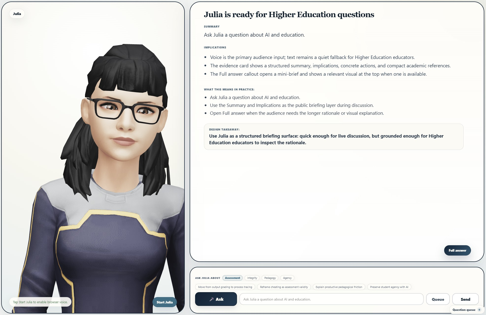
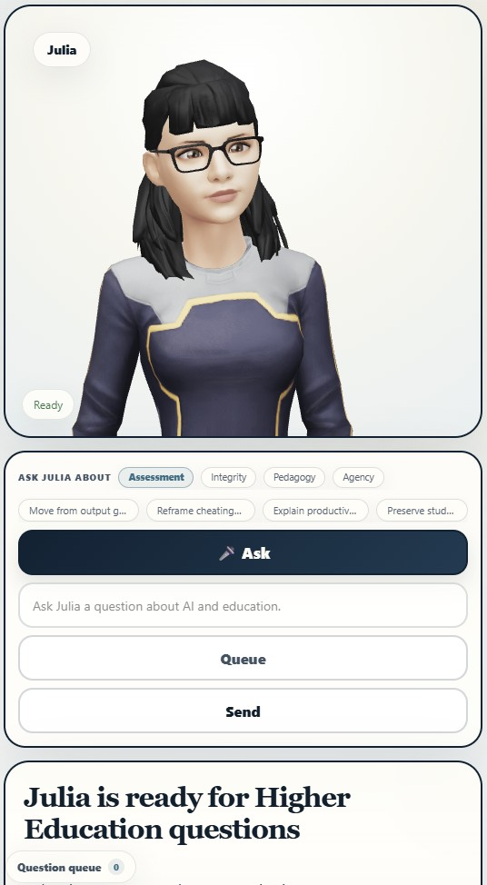

# Ask Julia

## What is Ask Julia?

Ask Julia is an interactive avatar guide designed to help people explore evidence-informed ideas about AI, teaching, learning, and higher education.

It is built for a simple purpose: to let users ask natural questions and receive clear, concise answers grounded in a curated knowledge base. Instead of browsing through long documents, users can ask Julia directly and receive a spoken response, a short evidence summary, and a fuller explanation when needed.

Ask Julia is not designed to answer every possible question. It works best when questions are related to the app’s knowledge base and intended topic area.

---
<table style="border:2px solid red; border-collapse:collapse;">
  <tr>
    <td style="border:2px solid red; text-align:center; vertical-align:middle;"></td>
    <td style="border:2px solid red; text-align:center; vertical-align:middle;"></td>
  
  </tr>
</table> 
---
## What Julia can help with

Julia can help users think through questions such as:

- How AI may affect teaching and learning.
- How educators can use AI responsibly.
- What opportunities and risks AI creates in higher education.
- How institutions might support students and staff in AI-augmented learning environments.
- What practical design implications follow from current research and expert discussion.

Julia is especially useful for quick exploration, preparation for discussion, and making complex ideas easier to understand.

## What happens when you ask a question?

When you ask Julia a question, the app looks for the most relevant information in its prepared knowledge base and generates a response for the user.

A typical response includes:

1. **A spoken answer**
   Julia gives a short, audience-friendly explanation. This is the main response you hear.

2. **An evidence card**
   The evidence card summarizes the key idea, practical implications, design takeaway, and selected references.

3. **A fuller answer**
   If you want more detail, you can open the full answer panel. This gives a richer explanation while still keeping the response focused and readable.

The goal is not to overwhelm the user with raw documents. The goal is to make the knowledge base easier to question, interpret, and apply.

## How to use Ask Julia

### 1. Open the app

Open the private Ask Julia link in your browser.

The app may take a short time to load if it has not been used recently. This is normal for the hosted demo version.

### 2. Start Julia

Tap or click **Start Julia** or **Enable voice**.

This allows the browser to play Julia’s spoken responses. Most browsers require a user action before sound can begin.

### 3. Ask a question

You can ask a question in two ways:

- **Type your question** into the input box.
- **Use the microphone**, if your browser supports speech input.

Typed input is the most reliable option across all devices.

### 4. Using voice input

If voice input is available:

1. Tap the microphone button once to start listening.
2. Ask your question.
3. Tap the microphone button again to stop.
4. Julia will submit the question automatically.

If the browser does not support voice input, the app will still work using typed questions.

### 5. Read the evidence card

After Julia answers, look at the evidence card for the key supporting points. On mobile devices, the page may automatically scroll down to the evidence card after Julia finishes speaking.

### 6. Open the full answer if needed

Use the full answer option when you want more explanation than the short spoken answer provides.

On mobile, the full answer opens as a larger view with a visible close button.

## What the status labels mean

The app may show short status messages while you use it:

- **Starting** means the app is loading or preparing voice features.
- **Ready** means Julia is ready for a question.
- **Listening** means the microphone is active.
- **Thinking** means Julia is preparing an answer.
- **Speaking** means Julia is giving the answer aloud.
- **Text only** means the app is still usable, but voice features are unavailable or disabled.
- **Voice unavailable** means the browser could not provide voice support.

These labels are there to make the interaction clearer, especially on mobile devices.

## What Ask Julia is best at

Ask Julia works best for:

- Focused questions.
- Discussion preparation.
- Quick briefings.
- Exploring practical implications.
- Connecting research-informed ideas to education settings.
- Helping users move from broad questions to clearer thinking.

Good questions include:

- “What are the main risks of using AI in teaching?”
- “How should educators think about student use of AI?”
- “What does responsible AI adoption mean in higher education?”
- “How can AI support learning without replacing human judgment?”
- “What should institutions do to prepare staff for AI-augmented education?”

## What Ask Julia is not

Ask Julia is not:

- A general-purpose search engine.
- A replacement for reading original sources.
- A legal, medical, or policy authority.
- A tool for private student assessment decisions.
- A guarantee that every answer is complete or final.
- A system for uploading new documents or rebuilding its knowledge base during use.

It is a guided demo built around a specific prepared knowledge base.

## Reliability and limitations

Julia’s answers are designed to be useful, clear, and grounded in the app’s knowledge base. However, users should still apply judgment.

The app may be less effective when:

- The question is outside the intended topic area.
- The question is too vague.
- The browser does not support voice input.
- The device has limited speech or audio support.
- The hosted service is waking up after being idle.
- The live answering service is temporarily unavailable.

If Julia cannot answer at a given moment, try again shortly or rephrase the question.

## Privacy and appropriate use

Ask Julia is designed as a lightweight demo for selected users. It does not require an account to use through the private link.

Users should avoid entering sensitive personal information, confidential student information, private institutional data, or anything they would not want processed as part of a web-based question.

For best use, ask general or professional questions about the topic area rather than personal or confidential questions.

## Tips for better questions

For stronger answers:

- Ask one question at a time.
- Be specific about the setting or concern.
- Use plain language.
- Mention whether you want practical implications, risks, examples, or a short summary.
- Rephrase the question if the first answer is too broad.

Examples:

- “Give me three practical implications for educators.”
- “Explain this for a non-technical audience.”
- “What are the main risks for universities?”
- “What should staff be trained to do?”
- “What is the key takeaway for teaching practice?”

## Summary

Ask Julia is a simple interactive guide for asking questions about AI and higher education. It combines a conversational avatar, spoken answers, evidence summaries, and fuller explanations to make a curated knowledge base easier to use.

It is best used as a discussion and preparation tool: ask a focused question, listen to the short answer, review the evidence card, and open the full answer when more detail is needed.
